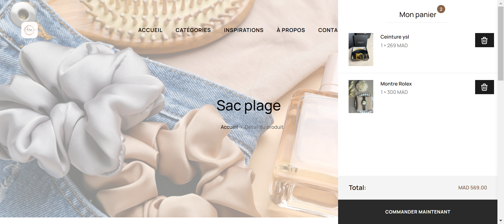

<p align="center"><a href="https://lamssafashion.com" target="_blank">
    </a>
</p>

# Lamssa Fashion

Welcome to **Lamssa Fashion** - your go-to Laravel-powered online store for the latest women's clothing. Visit us at [lamssafashion.com](https://lamssafashion.com).

## Table of Contents

- [About](#about)
- [Features](#features)
- [Screenshots](#screenshots)
- [Demo](#demo)
- [Technologies Used](#technologies-used)
- [Installation](#installation)
- [Usage](#usage)
- [Contributing](#contributing)
- [License](#license)
- [Contact](#contact)

## About

Lamssa Fashion is an online store dedicated to bringing the latest trends in women's fashion directly to your fingertips. Our platform is built on Laravel, a robust PHP framework, ensuring a seamless and responsive shopping experience. Whether you're looking for chic dresses, comfortable loungewear, or stylish accessories, Lamssa Fashion has it all.

## Features

- **User-Friendly Interface**: Easy navigation and intuitive design.
- **Product Search and Filters**: Quickly find the products you love.
- **Secure Checkout**: Safe and secure payment processing.
- **Responsive Design**: Optimized for all devices.
- **Admin Dashboard**: Manage products, orders, and users with ease.
- **Wishlist**: Save your favorite items for later.
- **Order Tracking**: Keep track of your orders in real-time.

## Screenshots




## Demo

Check out our live demo at [lamssafashion.com](https://lamssafashion.com).

## Technologies Used

- **Backend**: Laravel
- **Frontend**: Blade templates, Bootstrap, CSS, JavaScript
- **Database**: MySQL
- **Version Control**: Git
- **Payment Gateway**: Stripe/PayPal

## Installation

Follow these steps to clone and set up Lamssa Fashion locally.

### Prerequisites

- PHP >= 7.4
- Composer
- MySQL
- Node.js & npm

### Clone the Repository

```bash
git clone https://github.com/yourusername/lamssa-fashion.git
cd lamssa-fashion
```

### Install Dependencies

```bash
composer install
npm install
```

### Setup Environment

1. Copy the `.env.example` file to `.env`:

```bash
cp .env.example .env
```

2. Generate the application key:

```bash
php artisan key:generate
```

3. Update the `.env` file with your database and other configurations:
```
DB_CONNECTION=mysql
DB_HOST=127.0.0.1
DB_PORT=3306
DB_DATABASE=lamssa_fashion
DB_USERNAME=your_username
DB_PASSWORD=your_password

# Add other necessary configurations
```

### Run Migrations and Seed Database

```bash
php artisan migrate --seed
```

### Build Frontend Assets

```bash
npm run dev
```

### Start the Development Server

```bash
php artisan serve
```

Visit `http://localhost:8000` in your browser to see the application.

## Usage

- **Admin Panel**: Accessible at `http://localhost:8000/admin` (default login credentials are in the seeder file).
- **User Registration**: Users can sign up and start shopping immediately.
- **Product Management**: Admins can add, edit, and delete products via the admin panel.

## Contributing

We welcome contributions from the community! To contribute:

1. Fork the repository.
2. Create a new branch: `git checkout -b feature-branch-name`.
3. Make and commit your changes: `git commit -m 'Add new feature'`.
4. Push to the branch: `git push origin feature-branch-name`.
5. Open a pull request.

Please read our [SECURITY.md](SECURITY.md) for more details.

## License

This project is licensed under the MIT License - see the [LICENSE](LICENSE) file for details.

## Contact

For any inquiries, please get in touch with us at [support@freewsad.com](mailto:support@freewsad.com).

Thank you for choosing Lamssa Fashion!
```
